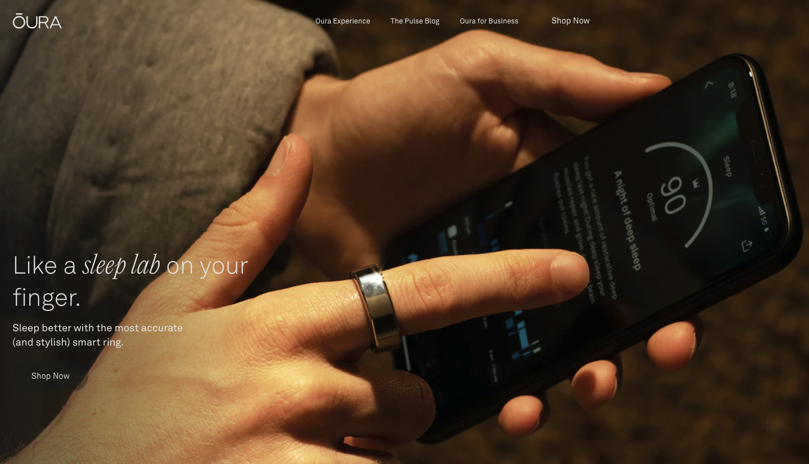

## It's not a question of Apple Watch OR Oura Ring, but Apple Watch AND Oura Ring

Interested in learning more about your health while looking cool? Check out the Oura Ring at https://ouraring.com/

I've been using it and I like it, I think that's all the convincing you need

I think the Apple Watch is good for controlling music and checking text messages without having to carry my phone around.  I also like the Apple Maps haptics.

The Oura Ring tracks my heart rate more accurately and has a better battery life.  I think it really just compliments the Apple Watch than competes/replaces it.

